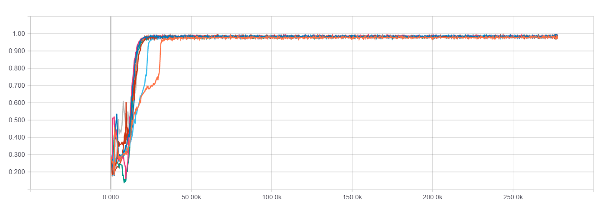
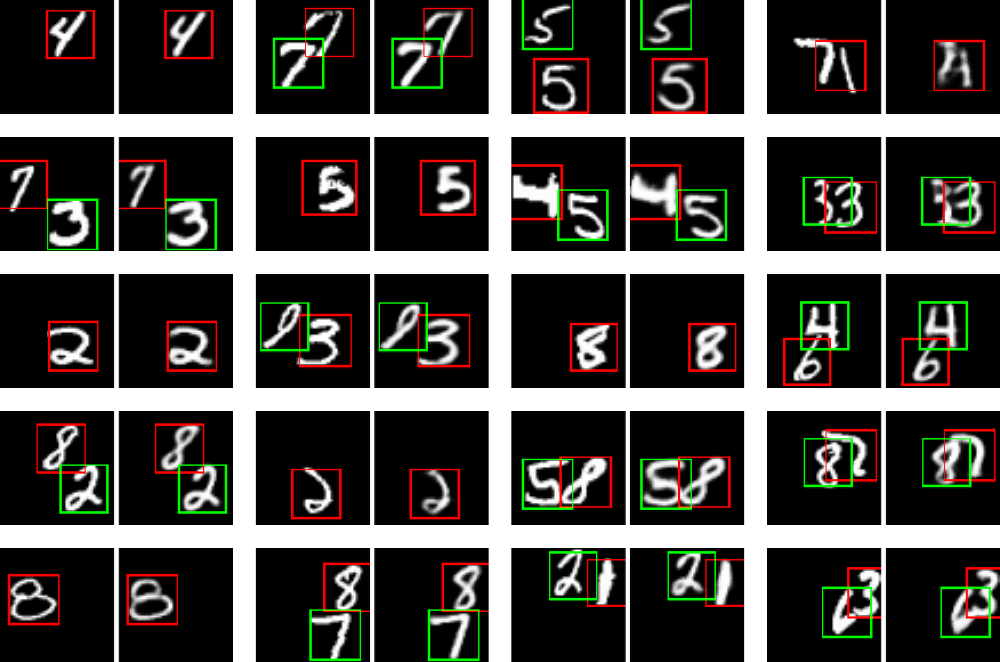

Attend, Infer, Repeat
=====================

Implementation of continuous relaxation of **AIR** framework proposed in **"Attend, Infer, Repeat: Fast Scene Understanding with Generative Models"** ([Eslami et al., 2016](https://arxiv.org/abs/1603.08575)). The work has been done in equal contributions with [Alexander Prams](https://github.com/aprams). The model is implemented in TensorFlow.

* [**multi_mnist.py**](multi_mnist.py) needs to be run before training the model for generation of multi-MNIST dataset: 60,000 50x50-pixel images with 0, 1, or 2 random non-overlapping MNIST digits.
* [**training.py**](training.py) is a runnable script for training the model with default hyperparameter configuration parameters (passed to the constructor of AIRModel class). While  training takes place, its progress is written to the sub-folders of "air_results" folder: complete snapshot of the source code in "source", periodic model checkpoints in "model", and rich TensorBoard summaries (including attention/reconstruction samples) in "summary".
* [**demo.py**](demo.py) is a live demo of trained model's performance (using saved parameter values from [**model**](model) folder) that allows drawing digits in a  Python GUI and attending/reconstructing them in real time.
* [**embeddings.py**](embeddings.py) generates TensorBoard projector summaries (in "embeddings" folder) for low-dimensional t-SNE or PCA visualization of 50-dimensional VAE latent space of attended/reconstructed digits vs. their ground truth labels.
* [**air/air_model.py**](air/air_model.py) is extensively configurable AIRModel class, which comprises the model implementation.
* [**air/transformer.py**](air/transformer.py) is a Spatial Transformer implementation borrowed from [TensorFlow models repository](https://github.com/tensorflow/models/blob/master/research/transformer/spatial_transformer.py).
* [**model**](model) folder contains TenorFlow checkpoint with the parameter values of the model trained for 270k iterations with the default hyperparameter configuration specified in [**training.py**](training.py). These parameter values are used in [**demo.py**](demo.py) and [**embeddings.py**](embeddings.py).

Noisy gradients of discrete zpres (Bernoulli random variable sampled to predict the presence of another digit on a canvas: 1 meaning “yes”, 0 – “no”) caused severe stability issues in training the model. NVIL ([Mnih & Gregor, 2014](https://arxiv.org/abs/1402.0030)) was originally used to alleviate the problem of gradient noise, but it did not make the training process stable enough. Concrete (Gumbel-Softmax) random variable ([Maddison et al., 2016](https://arxiv.org/abs/1611.00712), [Jang et al., 2016](https://arxiv.org/abs/1611.01144)) – a continuous relaxation of discrete random variable – was employed to improve training stability.

Discrete zpres was replaced by continuous analogue sampled from Concrete distribution with temperature 1.0 and taking values between 0 and 1. Correspondingly, original Bernoulli KL-divergence was replaced by MC-sample of Concrete KL-divergence. Furthermore, two additional adaptations were made. First, VAE reconstructions were scaled by zpres before being added to reconstruction canvas. This pushes continuous samples to 0 or 1 when the model wants to stop or attend to another digit respectively. Second, inspired by ACT ([Graves, 2016](https://arxiv.org/abs/1603.08983)), stopping criterion was reformulated as a running sum of (1 – zpres) values at each time step exceeding some configurable threshold (0.99 used in experiments). The threshold being less than 1 allows stopping during very first time step, which is essential for empty images that should not be attended at all. As a result, in the limit of Concrete zpres samples taking extreme values of 0 and 1 this relaxed model turns into the original AIR with discrete zpres.

After applying the continuous relaxation, 10 out of 10 training runs in a row converged towards 98% digit count accuracy in the average course of 25,000 iterations. All 10 trainings were conducted for 300 epochs (276k iterations) with the default set of hyperparameters from [**training.py**](training.py), some of them being: 256 LSTM cells, learning rate of 10-4, gradient clipping with the global norm of 1.0, and smooth exponential decay of zpres prior log-odds from 104 to 10-9 during the first 40,000 iterations. Below charts show digit count accuracy for the entire validation set (above) and its subsets of 0-, 1-, and 2-digit (left to right) images respectively (below):

 subsets of validation set")

The samples of attention/reconstruction made by an AIR model trained with [**traning.py**](training.py) (for each pair: original on the left, reconstruction on the right; red attention window corresponds to the first time step, green – to the second one):

